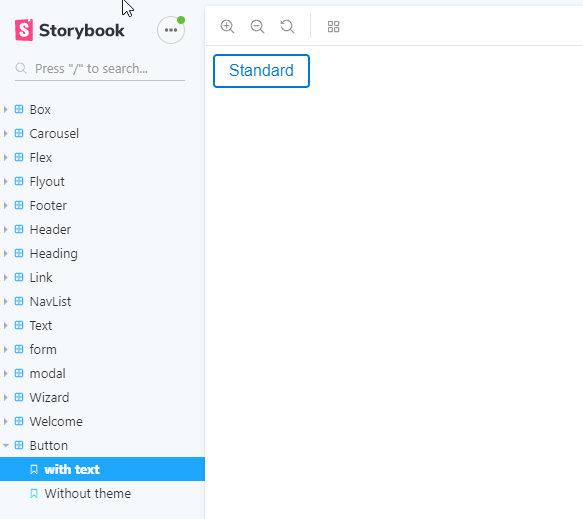
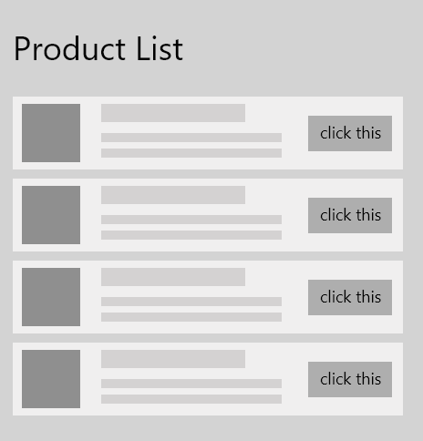

Software development, as an industry, has a constant struggle with shipping quality code. While many developers have metrics for what quality means, there's a challenge in ensuring these metrics are met especially as a codebase grows over time.

> We build our computer systems the way we build our cities: over time, without a plan, and on top of ruins.

<div class="quoteCite">- Ellen Ullman</div>

## Mise en place

While software development is a relatively young field, there are more established industries that we can learn from to help us write better code. For generations, chefs tout a mise en place mindset as a technique that is critical to success in the kitchen.

> The system that makes kitchens go is called mise-en-place

<div class="quoteCite"><a href="https://www.npr.org/sections/thesalt/2014/08/11/338850091/for-a-more-ordered-life-organize-like-a-chef">The Salt, NPR</a></div>

Or stated a different way

> Mise en place refers to all of these various components that are prepared ahead of time and you have in place for that moment when you get the order and you put the dish together.

<div class="quoteCite"><a href="https://www.amazon.com/Every-Tools-Hammer-Life-What/dp/1982113472">from Every Tool's a Hammer (by Adam Savage)</a></div>

Mise en place is the organization and mindset that goes into preparing a meal. It's something that may seem like more work ahead of time but can help ensure productivity, consistency, and quality.

## What does this have to do with building our frontend applications?

Many frontend technologies have the concept of components. Components are building blocks of our frontend applications but can be overlooked as a tool for ensuring productivity, consistency, and quality. Often times we see focus on the screens that a user of our application sees and overlook the building blocks of these screens. If care and attention to detail are not exercised, it's easy to end up with a series of one-off and duplicate components in a codebase.

[Brad Frost has an excellent book called Atomic Design](http://atomicdesign.bradfrost.com/) about building great design systems. In this book, ([and related article](http://bradfrost.com/blog/post/atomic-web-design/)) he defines a design system (or component library) as a series of levels. In this methodology, base level components are atoms, atoms compose into molecules, which compose into organisms and so on (I highly recommend Brad's [post](http://bradfrost.com/blog/post/atomic-web-design/) / [book](http://atomicdesign.bradfrost.com/) to really see this mindset in action). While I generally do not use the same terminology, I appreciate the concept of base level components and compound components for building reusable front-end applications.

You may notice that some of these concepts apply to the mise en place mindset we're discussing. We can build our components before creating a single screen / page in our application.

## How can we apply a mise en place philosophy to our codebase?

If you're on board with this mindset, you may find it helpful to work on components in isolation, outside of the standard placement in an application. At the most simple level, we could create test pages for each component. This can introduce some challenges ensuring that the pages don't get deployed, that other developers know where to find them and other things of this nature.

Thankfully, there are many tools for working with components in isolation. [Storybook](https://storybook.js.org/) is the one I use most.

Using Storybook, we can add "stories" for each of our components. A story is a function that defines what should be rendered as well as ways to interact with the inputs and outputs of the components we are developing (these are generally through [Storybook addons](https://storybook.js.org/addons/)). Imagine we are building a component library that has base components like Button, Text, Card, etc. and a series of more complex compositions of these components. We would develop these lower level components entirely in Storybook and only later hook them up with actual data in our application.

Storybook helps speed up the process of creating component libraries by allowing us to run our components outside of our standard application. For example, `yarn storybook` could be configured to start Storybook, where `yarn start` could be configured to run the development version of the application.


<div class="center"><small>Very basic storybook window</small></div>
<br /><br />
This separation between where we develop components vs. where we build our application can be very helpful when applying a mise en place mindset. We can see Storybook as the workspace we are preparing and the application screens as the dish that is composed of the various ingredients we prepared in advance.
<br /><br />

## How does this actually help me?

In the culinary world, a chef can make many dishes out of a small number of ingredients expertly prepared. Ingredients are composed to make components of a dish and these components are turned into full meals. This allows chefs to _quickly_ build many dishes of similar quality and consistency.

Lets use the "fast casual" restaurant Chipotle as an example. There are a series of meal components prepared in advance and ready to be composed into a meal. Imagine how long it would take to create if every time a customer placed an order, the people preparing the meal needed to cook and prep every part of the meal. Outside of the time it would take, this would open up the process to more variation which may result in lower quality.

This has a parallel in software development as well. If we build components that are tested and meet the quality standards we desire, we can build screens that give us a higher degree of confidence in the result in less time.

Lets imagine that we need to build two screens for an application. Product Listing and Product Detail. We want related products on product detail to look exactly like the product list.

### Product listing



### Product detail

<br />

We could build a list item component that would be (pseudocode/JSX-like) like the following:

```
// ListItem output - JSX like but pseudo code
<Card>
  <Flex flexDirection="row">
    <ProductImage src={imageSrc} />
    <Flex flexDirection="column">
      <Heading>{headingText}</Heading>
      <Text>{description}</Text>
    </Flex>
    <Button onClick={onClick}>Click this</Button>
  </Flex>
</Card>
```

Once we have this in place, we can reuse this in both ProductList and ProductDetail. <br />
`<ListItem headingText="Some Item" description="This is the description ..." ... />`

You'll notice that while this ListItem is a resuable component, it consists of other reusable components. Flex / Heading / Button, etc could all be lower level components ([While this is pseudocode, the usage of Flex is basically a Rebass Flex component](https://rebassjs.org/flex)).

## Wrapping up

While there are thousands of opinions on great ways to develop applications, I've found that applying a mise en place philosophy increases quality, consitency, and ultimately productivity while building frontend applications.

> I think if we just became a little bit more organized, used a little bit more mise-en-place, understood what we really need and only do what we really need, I think we'll have more time

<div class="quoteCite">- Dwayne Lipuma <small>Culinary Institue of America</small></div>
