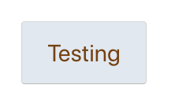

<iframe width="560" height="315" src="https://www.youtube.com/embed/FfEe8uJaOt8" frameborder="0" allow="accelerometer; autoplay; encrypted-media; gyroscope; picture-in-picture" allowfullscreen></iframe>

Tailwind is a CSS library in a similar space to things like Bootstrap or Bulma. Tailwind is different that instead of providing CSS for full components, it provides low-level utility classes. What this means is that instead of using class=“button” or “card” or something else, you’ll define your own button by composing Tailwind’s utility classes.

For an example of this, we’ll look at some HTML of a card created with Bootstrap and then a card created with Tailwind.

**Bootstrap - [See example on CodePen](https://codepen.io/ryanlanciaux/pen/dyPzXBz)**

```HTML
<!-- from the Bootstrap documentation
     https://getbootstrap.com/docs/4.0/components/card/
-->
<div class="card" style="width: 18rem;">
  
  <div class="card-body">
    <h5 class="card-title">Card title</h5>
    <p class="card-text">
      Some quick example text to build on the card title and make up the bulk of
      the card's content.
    </p>
    <a href="#" class="btn btn-primary">Go somewhere</a>
  </div>
</div>
```

**Tailwind - [See example on CodePen](https://codepen.io/ryanlanciaux/pen/KKwvMOj)**

```HTML
<div class="w-64 rounded overflow-hidden shadow-lg">
  
  <div class="px-6 py-4">
    <div class="font-bold text-xl mb-2">Card Title</div>
    <p class="text-gray-700 text-base">
      Some quick example text
    </p>
  </div>
  <div class="px-6 py-4">
    <button class="bg-blue-800 py-2 px-2 rounded text-white">
      Go Somewhere
    </button>
  </div>
</div>
```

You may have noticed that the Tailwind card has more verbose CSS class properties. However, we can now adjust how our component looks without changing CSS directly.

For example, if we wanted to give the card a background, we could apply a bg-color class to our opening div: `<div class="w-64 rounded overflow-hidden shadow-lg bg-indigo-300">...</div>`. The `bg-indigo-300` class is one example of a Tailwind Utility Class.

## With React

We’re going to start with a default Create React Project.

```
> npx create-react-app react-tailwind-example
```

Next, we'll add a couple dependencies

```
> yarn add tailwindcss tailwind.macro@next @emotion/core @emotion/styled
```

<small>If you prefer styled-components, you could include that instead of `@emotion/core @emotion/styled`</small>

- [Tailwind](https://www.npmjs.com/package/tailwindcss) is the Tailwind library.
- [Tailwind.Macro](https://www.npmjs.com/package/tailwind.macro) is a Babel plugin macro for using babel-plugin-tailwind-components package without additional configuration. Please see [kentcdodds/babel-plugin-macros](https://github.com/kentcdodds/babel-plugin-macros) if you're interested in learning more about Babel plugin macros.
- [@emotion/core | @emotion/styled](https://emotion.sh/docs/introduction) - The css-in-js library we're using in this example.

We’re ready to start writing some example code that uses these libraries. We'll replace App.js with the following code:

```
import React from "react";
import styled from "@emotion/styled";
import tw from "tailwind.macro";

const Button = styled.button`
  ${tw`bg-gray-300 text-yellow-900 px-8 m-8 rounded h-20 text-3xl`}
`;

export default function() {
  return <Button>Testing</Button>;
}
```

Example output:


The styled component, Button, is using the Tailwind Macro `tw` to apply utility classes for things like a background color, rounded corners, font-size, etc. Combining Tailwind with Emotion or Styled-Components allows us to build flexible components quickly.

Using Tailwind CSS with my React applications has been extremely useful for me. I hope you find it helpful also.
