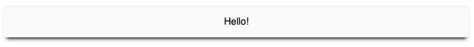

<iframe width="560" height="315" src="https://www.youtube.com/embed/FjHPo1E9HK8" frameborder="0" allow="accelerometer; autoplay; encrypted-media; gyroscope; picture-in-picture" allowfullscreen></iframe>

In this article, we are going to take a quick look at styled components, a styling library for use with React. While there are many ways to style React applications, styled components stands out as an excellent way style our applications as a series of components using familiar CSS syntax.

We will start by adding styled-components to our application through yarn or npm.

```
> yarn add styled-components
```

From our default React application, we’ll jump over to `App.js` and import styled from `styled-components`. We're ready to create our first styled component that we'll call Card by typing `const card = styled.div` - noting that our `Card` component will render as a `div`. We'll add a template literal directly after div and provide some CSS that defines a border, shadow, and padding — as well as a couple other properties. We should end up with something like this:

```javascript
import styled from 'styled-components'
...
const Card = styled.div`
  border: 1px solid #ededed;
  box-shadow: 0 8px 6px -6px;
  padding: 16px;
  border-radius: 5px;
  background-color: #fafafa;
  margin: 20px 0px;
`

export default function App() {
  return (
    <div className="App">
      <Card>Hello!</Card>
    </div>
  )
}
```


<br />

## Passing props to styled components

Now we can reuse this card component just like any other React component but what if we wanted to specify variations to this component? Maybe we want to have a version of the card that was highlighted a bit more.

Thankfully, since this is a component, we can pass props to it and interact with them in our styled definition through an interpolation. We’ll add a `shouldHighlight` prop to our App component specifying that `shouldHighlight = true`. After this, we'll add a string interpolation arrow function. This function will use props and will return either our default grey color or a highlight color.

```javascript
const Card = styled.div`
  border: 1px solid ${props => (props.shouldHighlight ? "#F09" : "#EDEDED")};
  box-shadow: 0 8px 6px -6px;
  padding: 16px;
  border-radius: 5px;
  background-color: #fafafa;
  margin: 20px 0px;
`

export default function App() {
  return (
    <div className="App">
      <Card>Hello!</Card>

      <Card shouldHighlight>Highlighted Card</Card>
    </div>
  )
}
```


<br />

## Themes

So far, we’ve been providing our colors, font-sizes etc, directly in our styled components. What if we had a `Text` component where we wanted to use the same highlight color? In our trivial example it would be relatively easy to duplicate the colors in each style definition. In a larger application, however, this could become a bit unwieldy to manage. This is where a theme is extremely useful.

A [theme](https://www.styled-components.com/docs/advanced), is a javascript object where we can specify properties that we can use in our styled components. We could create a theme object that contains our colors.

```javascript
const theme = {
  colors: {
    highlight: "#F09",
    grey: "#EDEDED",
  },
}
```

Once we have this theme object, we’ll place, we’ll want to utilize a `ThemeProvider` and pass our newly created theme to this provider as the `theme` prop.

```
export default function App() {
  return (
    <ThemeProvider theme={theme}>
      <div className="App">
        <Card>Hello!</Card>

        <Card shouldHighlight>Highlighted Card</Card>
        <Text>Some text</Text>
      </div>
    </ThemeProvider>
  );
}
```

Now any component that is rendered under this provider has access to our theme. We can update our components to utilize the theme prop:

```
const Card = styled.div`
  border: 1px solid
    ${props =>
      props.shouldHighlight
        ? props.theme.colors.highlight
        : props.theme.colors.grey};
  box-shadow: 0 8px 6px -6px;
  padding: 16px;
  border-radius: 5px;
  background-color: #fafafa;
  margin: 20px 0px;
`;

const Text = styled.span`
  color: ${props => props.theme.colors.highlight};
`;
```

I’ve found styled components to be an excellent way to style applications built with React (for teams that are on-board with a css-in-js based mindset). I would love to know your thoughts or of any ways you’ve found useful to style your applications. [Please let me know what you think on Twitter](https://twitter.com/ryanlanciaux). You can [take a look at the finished example on CodeSandbox](https://codesandbox.io/s/exciting-mestorf-foph3)
