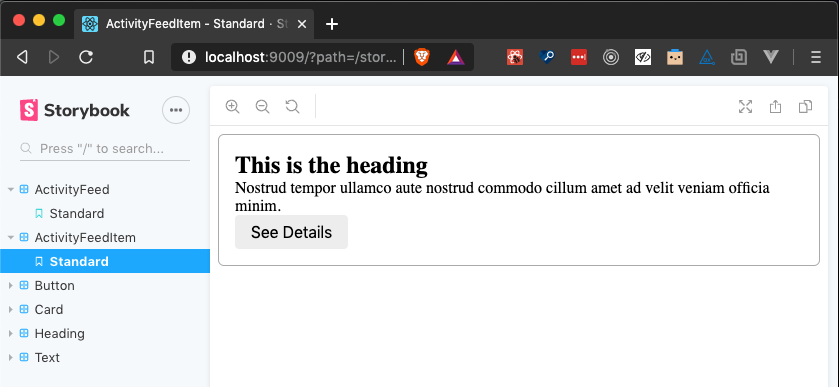

<iframe width="560" height="315" src="https://www.youtube.com/embed/C3UrkCVulaE" frameborder="0" allow="accelerometer; autoplay; encrypted-media; gyroscope; picture-in-picture" allowfullscreen></iframe>

In this article, we will discuss strategy that I like to help keep [Storybook](https://storybook.js.org/) stories up-to-date. For those that are unfamiliar, [Storybook](https://storybook.js.org/) is a UI component workspace that I find helpful in building front-end applications.

It allows you to develop your components in isolation, interact with these components individually, and see quality issues at a much more granular level than the screen or page level. Additionally, this workspace serves as communication to other developers, noting the reusable components that exist in a system. [Learn more about Storybook here](https://storybook.js.org/).

One criticism I often hear is that it's easy for a [Storybook](https://storybook.js.org/) project to get out-of-date when developers forget to add their components to Storybook. I often find that Storybook speeds up development but understand the tendency to build new components in the context of the live, running application. It's easy to forget about adding stories when you have an otherwise working and tested feature.

How do we keep this "building components in isolation" mindset top-of-mind in a way that provides immediate value to others may not necessarily develop their components in Storybook first? In this scenario, I often like to treat stories as part of my testing strategy.

## Traditional Testing

Let's assume we are building an activity feed. On our activity feed item component, we want to ensure that we're rendering the correct text, and the button onClick event fires as expected. We could use [react-testing-library](https://testing-library.com/docs/react-testing-library/intro) to establish confidence that our component is working as anticipated.

We'll use the `render` utility to render the component that we wish to test. We'll check the text and onClick functionality to ensure that everything is working.

```javascript
// ActivityFeedItem.js
export default function ActivityFeedItem({ name, text, onClick }) {
  return (
    <Card>
      <Heading>{name}</Heading>
      <Text>{text}</Text>
      <Button onClick={onClick}>See Details</Button>
    </Card>
  );
}

// ActivityFeedItem.test.js
import { render } from '@testing-library/react';
...
it("shows the correct text", () => {
  const { getByText } = render(
    <ActivityFeedItem
      name="This is the heading!"
      text="Nostrud tempor ullamco aute nostrud commodo cillum amet ad velit veniam officia minim."
    />
  );

  expect(
    getByText(
      "Nostrud tempor ullamco aute nostrud commodo cillum amet ad velit veniam officia minim."
    )
  ).toBeInTheDocument();
});
```

When we run our tests, we'll see that all is working as expected.

```
Test Suites: 7 passed, 7 total
Tests:       9 passed, 9 total
Snapshots:   5 passed, 5 total
Time:        2.62s
Ran all test suites.
```

## Debugging failing tests

What happens if our test is failing, and we want to dive in to debug?

```
Test Suites: 1 failed, 6 passed, 7 total
```

There are a couple of options but, one I use a lot is the `debug` utility from React testing library. This utility illuminates the HTML for the rendered element.

We could update our test as follows to leverage `debug`:

```javascript
const { getByText, debug } = render(
  <ActivityFeedItem
    name="This is the heading!"
    text="Sit enim irure pariatur nostrud id non deserunt laboris veniam velit."
  />
)

debug()
```

The `debug` utility will log the HTML for our components. This strategy would work well for our trivial example component, but on a more substantial component, this can get unwieldy pretty quickly.

Instead of defining our elements to render directly in our test, we can leverage Storybook stories for this. We'll use stories written in Storybook's [component story format](https://storybook.js.org/docs/formats/component-story-format/) to serve as the element we wish to `render` in our test.

We'll create the story metadata first. This metadata provides information to Storybook about how we should display our stories within the utility. Next, we'll create a story with the component story format. You may notice that we're creating an arrow function, which is not unique to Storybook. We can export this arrow function and import it in our test.

```javascript
// ActivityFeedItem.stories.js
export default { title: "ActivityFeedItem" }

export const standard = (callback = undefined) => {
  return (
    <ActivityFeedItem
      name="This is the heading"
      text="Nostrud tempor ullamco aute nostrud commodo cillum amet ad velit veniam officia minim."
      onClick={callback}
    />
  )
}
```

## Using the story in our test

Before where we `rendered` our component in the test, we'll use the imported story instead. Now, if we want to debug our test, we have a story we can use in addition to the other debugging strategies we may traditionally use.

```javascript
import { standard } from "./ActivityFeedItem.stories"

it("shows the correct text", () => {
  const { getByText } = render(standard())

  expect(
    getByText(
      "Nostrud tempor ullamco aute nostrud commodo cillum amet ad velit veiam officia minim."
    )
  ).toBeInTheDocument()
})
```



We now have a way to visualize and interact with the component we're testing.

## Wrapping up

Storybook provides many benefits beyond testing, but sometimes it's easy to forget when we're trying to get features out the door. I've found that using Storybook as a tool to help ensure quality helps avoid this situation where stories become out-of-date or neglected.
