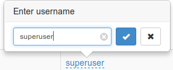

I was recently working on a project with [AngularJS](http://www.angularjs.org) and [xeditable](http://vitalets.github.io/x-editable/) (if you're not familiar, xeditable is an awesome library for inline editing). There is an [Angular version of xeditable](http://vitalets.github.io/angular-xeditable/) but the popover editing functionality is not implemented yet (it's in the roadmap). Instead of using the original version of xeditable and implementing custom directives or try to add the popover functionality to the project, I decided to see if I could make the popover using just CSS -- this happened to be more inline with my timeframe.

Take a look at the original (non-angular) popover:



Starting out, I noticed that clicking on the link of an xeditable element was showing an input element (and buttons) in a form and hiding the link. To mimic the popover, the link and the form should both be visible when the form was activated, however, the form should be positioned a bit higher than the link. Working with a forked version of [vitalets' jsfiddle](http://jsfiddle.net/NfPcH/3/) example, I wrapped the initial links in `<span class='item-wrapper'></span>` -- from there, I edited the link and the form's CSS as follows

```css
.item-wrapper a{
    /* make the link always show up */
    display: inline !important;
}

.item-wrapper{
    /* make absolutely positioned children constrained to this box*/
    position: relative;
}

.item-wrapper form {
    background: #FFF;
    border: 1px solid #AAA;
    border-radius: 5px;
    display: inline-block;
    left: 50%;

    /* half the width */
    margin-left: -110px;
    padding: 7px;
    position: absolute;
    top: -55px;
    width: 220px;
    z-index: 101;
}
```


It's a step in the right direction, however, doesn't really look exactly like we want. To get the triangle to show up below the pop-up, I thought it would be good to use the [technique for creating a triangle on css-tricks](http://css-tricks.com/snippets/css/css-triangle/) as an :after filter (please [check the link](http://css-tricks.com/snippets/css/css-triangle/) for more info on that because how it works is a bit outside the scope of this post).


 This works but it looks funny because the popover has a border but the triangle is just a solid color. Additionally, we cannot just toss a border on the :after filter since we're using the border to create the triangle. What I ended up doing is using a :before filter with a width of 10px and a background color the same as the border color followed by an :after filter 1px narrower and the same background color as the popover.

 

```css
.item-wrapper form:before{
    content:"";
    width: 0;
    height: 0;
    border-left: 10px solid transparent;
    border-right: 10px solid transparent;
    border-top: 10px solid #AAA;
    position:absolute;
    bottom:-10px;
    left:100px;
}

.item-wrapper form:after{
    content:"";
    width:0;
    height:0;
    border-left: 9px solid transparent;
    border-right: 9px solid transparent;
    border-top: 9px solid #FFF;
    position:absolute;
    bottom:-9px;
    left:101px;
}
```

There is a [jsfiddle of the example available here](http://jsfiddle.net/EWcUw/4/). A few things to note... I am only using this with the Angular-xeditable dropdowns and text boxes so the other controls may or may not work. Additionally, I added some javascript (not in the examples) to hide any visible popovers when displaying a new one. I was running into some issues displaying multiple (or displaying the same one multiple times).
