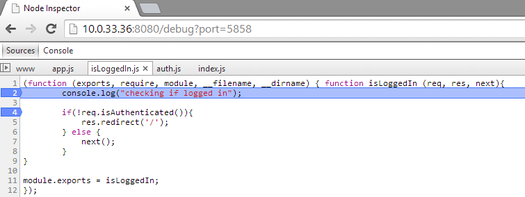

Coming from the .NET world, I've grown accustomed to great debugging tools. My initial Node setup didn't have a very good way to debug an application (outside of using `DEBUG=express:* node .bin/www`) and I wanted to resolve that. I had heard about [node-inspector](https://github.com/node-inspector/node-inspector) in several places and decided to give that a shot. 

Node-inspector is a visual interface for the Node debugger that looks like just Chrome Developer Tools for Chrome / Opera. I use the Developer Tools quite frequently for debugging front-end code so it is a natural fit for my work-flow.

##Setup

The guide on [the github page for node-inspector](https://github.com/node-inspector/node-inspector) is pretty good but I wanted to run through how I'm using it on my Express 4 application.

First, like the guides suggest, I ran `npm install -g node-inspector`. From there, I tried running the application (`node --debug ./bin/www`) and then running `node-debug`. Unfortunately, I mixed up node-debug and node-inspector a little bit and the inspector was throwing an `EADDRINUSE` error. Thankfully, [Peter Lyons](http://peterlyons.com/) quickly answered [a question I put on StackOverflow](http://stackoverflow.com/questions/23797931/node-inspector-with-express-4) which straightened out the issue I was encountering. Apparently, you either want to use `node --debug ___` and `node-inspector` or just `node-debug ____` -- using `node --debug _____.js` with the inspector's `node-debug` option was causing conflicts as both were starting node's debugger. 

Starting the application with `node --debug ./bin/www` followed by `node-inspector` (in another terminal) worked painlessly. I could open up the inspector website (generally `localhost:8080/debug?port=5858`) and set breakpoints. When navigating through my node application, the code execution was stopping at the breakpoint and I could debug from there using the standard Chrome Developer tools. 

##Forever
One final thing I wanted to do is get all this working with Forever as it would be nice to be able to make changes to my code with out needing to restart the node server. I have encountered some weirdness with forever and node-inspector but it does seem to work okay. Starting forever generally doesn't fire up the debugger. After some searching, I came across [this StackOverflow post](http://stackoverflow.com/questions/12819268/node-js-debugging-with-node-inspector-and-forever-js) that suggests you have to run a custom command to start forever in debug mode `forever -w -c 'node --debug' ./bin/www`. From there, I could navigate to both the site I was trying to debug and the inspector page and all seemed to work. 
