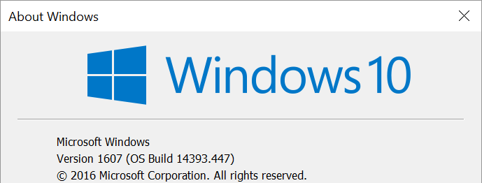
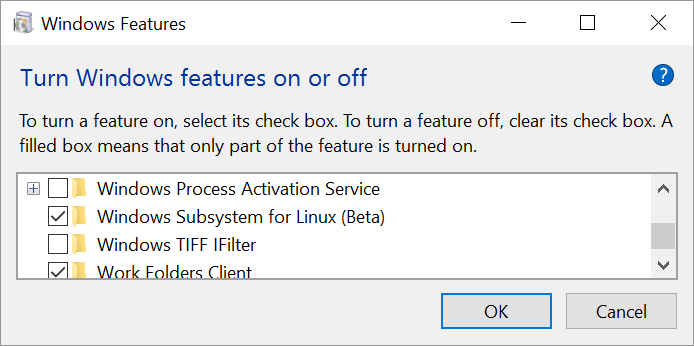
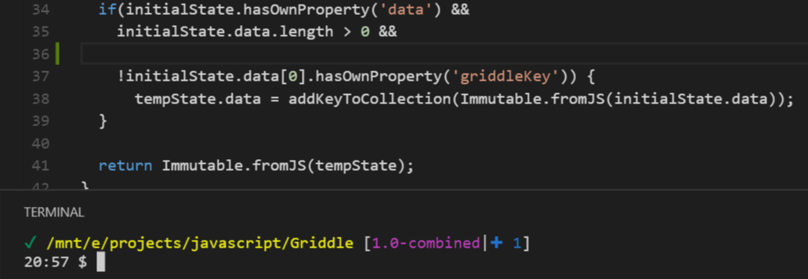

Inspired by some recent conversations on Twitter, I've decided to give Bash on Windows another shot. This post contains the steps I've taken to install and configure Bash on Windows to closely resemble my Linux / Mac settings for JavaScript and node development (with some extra steps I've taken for Ruby, etc at the end).

## 1. Enable Bash on Windows  ##

Bash on Windows requires the Anniversary update of Windows 10. Please make sure you have that before continuing. To determine what version of Windows you are running, open a command prompt window and type `winver`. If you see Version 1607, you should be good to proceed (thanks Josh Pollard).

Once that's all set go to `Settings -> Update & Security -> For Developers` and enable `Developer mode`. Finally, go to `Windows Features` and enable `Windows Subsystem for Linux`. Your computer should restart and you should be able to run Bash for Windows at this point.

See [Scott Hanselman's blog](http://www.hanselman.com/blog/DevelopersCanRunBashShellAndUsermodeUbuntuLinuxBinariesOnWindows10.aspx) or [Stefan Roth's post on TechNet](https://blogs.technet.microsoft.com/heyscriptingguy/2016/09/28/part-1-install-bash-on-windows-10-omi-cim-server-and-dsc-for-linux/) for more on this.

## 2. Update apt-get ##

We are going to be installing some things and it would be good to make sure we're up-to-date here. Launch bash by pressing the Windows key and typing `bash`. From there, `apt-get update` should obtain the latest package information. If you are running into issues with IPv6 vs IPv4 checkout this post on [Ask Ubuntu](http://askubuntu.com/questions/759524/problem-with-ipv6-sudo-apt-get-update-upgrade) or here on [BruteForce labs](https://bruteforce.gr/make-apt-get-use-ipv4-instead-ipv6.html).

## 3. Install nvm ##

nvm stands for Node version manager and is an essential part of my development environment. Using nvm allows you to switch what version of node you're using on a project by project basis. To install nvm, run `curl -o- https://raw.githubusercontent.com/creationix/nvm/v0.32.1/install.sh | bash` (from [the nvm documentation](https://github.com/creationix/nvm)) followed by `Source .bashrc`

## 4. Install git ##

Take the following steps to install git on Bash for Windows and be ready to work with projects on GitHub.

1. `apt-get install git` (see [GitHub's guides for more on this](https://help.github.com/articles/set-up-git/#platform-linux))
2. Generate [an access token](https://help.github.com/articles/creating-an-access-token-for-command-line-use/) or [a SSH key](https://help.github.com/articles/generating-a-new-ssh-key-and-adding-it-to-the-ssh-agent/#platform-linux) (and associate the key to your GitHub account)

## 5. Setup bash git prompt ##

[bash-git-prompt](https://github.com/magicmonty/bash-git-prompt) is, as the project describes, "An informative and fancy bash prompt for Git users" -- that is, it shows git information for the current repository when navigating to project folder.

To install bash-git-prompt:

1. `cd ~`
1. `git clone https://github.com/magicmonty/bash-git-prompt.git .bash-git-prompt --depth=1`
1. Add `GIT_PROMPT_ONLY_IN_REPO=1` to .bashrc

[Read through the documentation](https://github.com/magicmonty/bash-git-prompt) as there is a bit of configuration and themeing that's possible. That said, I'm running with the default for now.

## 6. Make Visual Studio Code use Bash ##

It's possible to toggle a terminal inside Visual Studio Code -- by default, this appears to be the standard command prompt. Thankfully, [Paul DeCarlo created a blog post](http://pjdecarlo.com/2016/06/bash-on-windows-as-integrated-terminal-in-visual-studio-code.html) explaining that you can add `"terminal.integrated.shell.windows": "C:\\Windows\\sysnative\\bash.exe"` to your user settings to use Bash as the default instead.

It should look like this if everything is working correctly:

## Extras ##

### Install tmux ###

tmux is a terminal multiplexer that lets you run multiple programs in one terminal (it does a lot more than that but [read the docs for more info](https://tmux.github.io/)). I frequently use tmux to run tests while running webpack server, [React Storybook](https://getstorybook.io/), or something else along those lines.

You can install tmux by running `apt-get install tmux`. Once tmux is installed on the system you can press `ctrl + b + c` to create a new window and `ctrl + b + w` to list the windows. [See this tmux cheatsheet for more](https://gist.github.com/MohamedAlaa/2961058)

### Install Ruby and Rails ###

I do a bit of Ruby work and highly recommend rbenv for multiple ruby versions. [Digital Ocean's guide to installing ruby / rbenv](https://www.digitalocean.com/community/tutorials/how-to-install-ruby-on-rails-with-rbenv-on-ubuntu-14-04) is great AND it works on Bash for Windows.

### Setup vim and Vundle ###

I use [Vim](http://www.vim.org/) quite a lot and [Vundle](https://github.com/VundleVim/Vundle.vim) for managing vim plugins.

1. `git clone https://github.com/VundleVim/Vundle.vim.git ~/.vim/bundle/Vundle.vim`
1. Setup your .vimrc (here's [my .vimrc](https://github.com/ryanlanciaux/dotfiles/blob/master/.vimrc) for example)
1. Run vim and type `:PluginInstall`

### Install cmder ###

[Cmder](http://cmder.net/) is a nice console emulator for Windows. You can run bash in cmder by typing `bash` from the prompt. You may have to type `cd ~`from there to get back to your standard bash home directory.

## The End ##

Please feel free to let me know of any questions or feel free to [submit a PR or issue](https://github.com/ryanlanciaux/ryanlanciaux.github.com) on anything that's mistaken here :)
