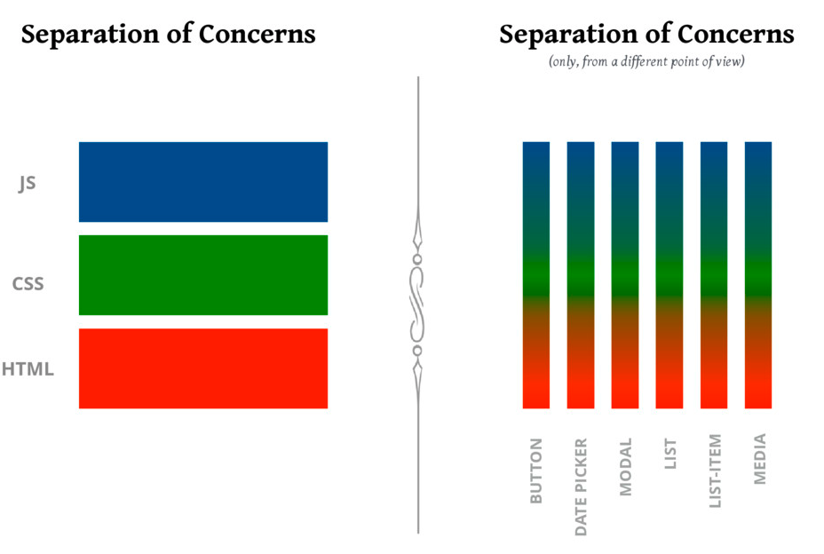
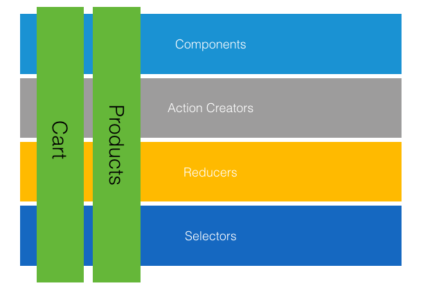
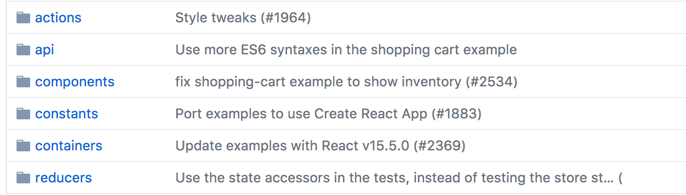

There are a lot of opinions around how to arrange a React project. In this post, I want to talk about feature folders and why I think they are a great choice for React application structure.

## Focus on the goal rather than the technology

In many languages and frameworks, the prevailing wisdom is to group like technologies together. For example, when starting a new Rails or .NET MVC project, we generally have a series of folders for Models, Views, Controllers, (sometimes services and other things as well). While we don't often have these types of items in React -- it is fairly common to see a Components directory, some sort of Utils directory, and if we're using Redux, a folder for Reducers, Actions, Selectors, and so on. This works great when a project is smaller but over time, this can be unwieldy -- especially when working with teams of people.

Feature folders help eliminate some of these problems by placing everything that is unique to one area of the code together. For instance, if we were making a login feature, we would have a folder for Login and in this folder we would have our login components, actionCreators, reducers, selectors, etc. 

```
src
|_ features/
|___ cart/
|_____ components/
|_____ actionCreators.js
|_____ index.js
|_____ reducer.js
|_____ selectors.js
|___ product/
|___ other/
```

This arranges our code by what the code's mission is and how it contributes to the overall goal of the project rather than the technology. 

## This is not much of a mental leap for React developers

In React, we are used to structuring our application as a series of components. Where traditional applications are built with a number of HTML files, CSS files, and JavaScript files, a component can encapsulate all of these things.

<div>



</div>

[from Cristiano Rastelli's "Let There Be Peace on CSS" talk](https://speakerdeck.com/didoo/let-there-be-peace-on-css)

What's interesting about this vision of separation of concerns is that it also reminiscent of the "Vertical Slices" terminology that is commonly used in some agile development circles (and also used as an argument for using feature folders). Instead of thinking of a system as a series of Actions, Reducers, Selectors, Components, an application can be imagined as a series of features. Features, at this point, can almost be seen as "components" of application structure.



## What about shared code?

Shared code can (and should) still exist in a feature based paradigm. There are some things that benefit many features and those could live in a "shared" directory.

## A non-exhaustive example

To illustrate how we could migrate an application to this strategy, lets compare the [Redux Shopping Cart](https://github.com/reactjs/redux/tree/master/examples/shopping-cart) to a [more feature-oriented example I've created](https://github.com/ryanlanciaux/react_feature_folder_example). 

The initial example exists as a series of items arranged by technology (e.g. components / containers / actionCreators, etc.)



To migrate to a more feature-oriented method of structuring our code (there are some files like tests and other things like that I leave out of this guide):

1. We'll start by creating a folder named `features` with a `cart` and `product` feature as sub folders.
1. Create `components` directories in the `products` and `cart` folders and move the `components` and `container` components into their respective directories. Product components go under `features/product/components` where Cart components go under `features/cart/components`
1. Move `reducers/cart.js` to `features/cart/reducer.js` and `reducers/product.js` to `features/product/reducer.js`. This could still be called cartReducer if desired, however, I generally prefer to name boilerplate items in a very generic manner (while still keeping components named very specific to their function). 
1. From here create a directory called `shared` and move `reducers/index` to `shared/reducer.js`
1. At this point, you can move the selectors from `shared/reducer.js` to their own file under their respective directory (view [features/cart/selectors.js](https://github.com/ryanlanciaux/react_feature_folder_example/blob/master/src/features/cart/selectors.js) and [features/product/selectors.js](https://github.com/ryanlanciaux/react_feature_folder_example/blob/master/src/features/product/selectors.js). I would generally recommend creating a `shared/selectors.js` file for containing selectors that are a combination of items that span more than one feature ([see an example of this here](https://github.com/ryanlanciaux/react_feature_folder_example/blob/master/src/shared/selectors.js)).
1. Move the methods from `/actions/index.js` to `features/cart/actionCreators.js` or `features/product/actionCreators.js`.
1. Create index files in each feature that export the main component as a default component and the other items as named exports. In this shopping cart example, the container component is the default export for both `cart` and `product`

```javascript
import Product from './components/ProductsContainer';

import * as actionCreators from './actionCreators';
import * as selectors from './selectors';
import reducer from './reducer';

export { actionCreators, selectors, reducer };

export default Product;
```

<br />

Once these steps are complete -- we can update any references to point to their new locations. **One thing of important note**: it's generally a good idea to reference any part of a feature through the feature's `index` rather than the file directly. This treats the index as each feature's API contract and quickly illuminates any issues that may occur with any refactoring.

<p />

[View the example on GitHub](https://github.com/ryanlanciaux/react_feature_folder_example)

## Benefits of this model
#### Code is structured in a way that reflects purpose

This makes it easier to find files and know where things belong. Additionally, it helps clarify how a bit of code contributes to the overall goals of an application.

#### Code is easier to refactor

If a feature has one entry point, it's clear that removing the feature will have limited impact on the rest of the system. Additionally, if changes are made to a login feature, they should have no impact on a "cart" feature.

#### Imagine applications a series of smaller applications

I like thinking of features as small applications that work together to a greater goal -- kind of like the [Unix Philosophy](https://en.wikipedia.org/wiki/Unix_philosophy) "Write _features_ that do one thing and do it well. Write _features_ to work together."

#### Feature Flags 

<small>(feature is kind of an overloaded term here)</small>

["Feature Flag is a technique to turn some functionality of your application off, via configuration, without deploying new code."](https://stackoverflow.com/a/11164444/1385358). While not entirely related, organizing an application as a series of features can make feature flags easier to implement. 

If we have a feature, buyNow structured as follows

```
...
|_ src/
|___ features/
|_____ buyNow/
|_______ components/
|_________ BuyNowButton.js
|_______ index.js
|_____ otherFeature
```

And our index for our buyNow feature looks like this

```javascript
import BuyNowButton from './components/BuyNowButton';

export default BuyNowButton;
```

We could have a simple feature / featureCheck for turning parts of our application on and off

```javascript
// overly simplistic for sake of example
const features = {
  ...
  buyNow: false
}

// overly simplistic for sake of example
export function isFeatureEnabled(feature) {
  return features[feature] || false;
}
```

We could adjust our index to return undefined instead of the component if the feature was disabled

```javascript
import { isFeatureEnabled } from '../shared/features';
import BuyNowButton from './components/BuyNowButton';

// ideally we would create something a bit more sophisticated for handling feature flags
export default isFeatureEnabled('buyNow') ? BuyNowButton : undefined;
```

When the `buyNow` feature is set to false in the featureFlag file, the component will not render.

## Wrapping up

* Structure application by features
* Feature is a vertical slice through application layers
* There should be some value when feature is done
* Organizing files by feature allows for quicker deletion/refactoring

[Feature example available here](https://github.com/ryanlanciaux/react_feature_folder_example)

## Additional Resources
* [Let There Be Peace On CSS by Cristiano Rastelli](https://speakerdeck.com/didoo/let-there-be-peace-on-css)
* [Feature slices in .NET Core](https://msdn.microsoft.com/en-us/magazine/mt763233.aspx)
* [SOLID Architecture in Slices not Layers - Jimmy Bogard](https://vimeo.com/131633177)
